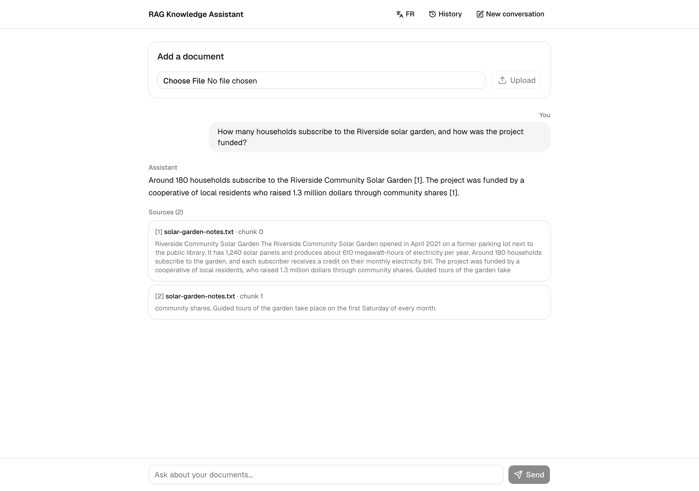

# RAG Knowledge Assistant

Upload your own documents (PDF, plain text, Markdown), then ask questions about them in natural
language. Every answer cites the document and chunk it came from, and follow-up questions keep the
context of the conversation.

See [PLANNING.md](./PLANNING.md) for architecture decisions, measurements and rationale.

## Live demo

**[https://rag-knowledge-assistant-navy.vercel.app](https://rag-knowledge-assistant-navy.vercel.app)**



The demo runs the production configuration: Gemini as the LLM, ONNX embeddings, a single shared
Chroma store. Two things to know before trying it:

- **It's a single-user portfolio deployment with no auth** — anything you upload is visible to the
  next visitor, so don't upload anything private.
- **Uploaded documents are not stored permanently.** The backend host has no persistent disk, so the
  Chroma store lives on the instance's ephemeral filesystem and **starts empty again after every
  deploy or restart**. If you ask a question and get "I don't have information about that in your documents" with no sources, the store has
  probably just been reset: upload a document first.

The first request after a deploy can take a while: on a fresh instance the embedding model (~90MB)
is downloaded on first use.

## How it works

```
Ingestion:  upload -> parse (pypdf / text) -> chunk -> embed (all-MiniLM-L6-v2, ONNX) -> Chroma
Query:      question (+ history) -> embed -> retrieve top-k -> relevance filtering
            -> prompt with numbered [n] sources -> LLM (Ollama or Gemini) -> answer + citations
```

- **Backend** — Python, FastAPI. `POST /documents` (upload + index), `POST /query`
  (`{question, top_k?, history?}` -> `{answer, has_context, citations}`), `GET /health`.
- **Vector store** — Chroma, persisted locally (cosine similarity).
- **Embeddings** — `all-MiniLM-L6-v2`, run locally through ONNX Runtime. No API key, no per-request cost.
- **LLM** — Ollama (`llama3.2`) locally for development, Google Gemini (Flash, free tier) in
  production, selected at runtime by `LLM_PROVIDER`.
- **Frontend** — Next.js 16 (App Router), TypeScript, Tailwind v4, shadcn/ui. Chat with inline
  citations, multi-conversation history, and an EN/FR toggle for the interface.

## Run

Prerequisites: Python 3, Node.js 20+, and [Ollama](https://ollama.com) with the model pulled
(`ollama pull llama3.2`) — or a Gemini API key to skip Ollama entirely.

**Backend**

```bash
cd backend
python -m venv .venv && source .venv/bin/activate
pip install -r requirements.txt
cp .env.example .env          # LLM_PROVIDER=ollama by default; set gemini + GEMINI_API_KEY for the cloud path
uvicorn app.main:app --reload
```

- API: http://localhost:8000 (`/health`, interactive docs at `/docs`)
- The embedding model downloads on the first upload or query (~90MB, cached afterwards).
- Chroma data lives in `backend/chroma_db/` (gitignored). Locally it persists across restarts; on
  the live demo it doesn't (see above).

**Frontend**

```bash
cd frontend
npm install
cp .env.local.example .env.local   # only needed if the backend isn't on http://localhost:8000
npm run dev
```

- UI: http://localhost:3000
- The backend's CORS allow-list defaults to the Next.js dev origin; set `FRONTEND_ORIGINS` in
  `backend/.env` for any other host.

## Tests

```bash
cd backend
pytest              # fast, hermetic unit tests (default)
pytest -m model     # loads the real embedding model + Chroma (relevance regression tests)
pytest -m ollama    # calls a real local Ollama server (skips if it's not running)
pytest -m gemini    # calls the real Gemini API (skips without GEMINI_API_KEY)
pytest -m ""        # everything
```

## Notable technical decisions

- **ONNX Runtime instead of PyTorch for embeddings.** The backend was originally built on
  `sentence-transformers`, and it was crashing out of memory mid-request on a 512MB instance. Measured:
  the PyTorch runtime import alone costs ~400MB — the ~90MB model weights were never the problem, so a
  smaller model wouldn't have helped. The fix was to run the *same* `all-MiniLM-L6-v2` weights through
  their ONNX export, via ONNX Runtime, which already ships with `chromadb` (no new dependency). Peak
  memory for a real upload-then-query cycle dropped from ~560–650MB to ~305–354MB. Verified rather than
  assumed that nothing else changed: the two runtimes produce float32-identical vectors (max absolute
  difference 0.000000), and every relevance regression test passed without recalibrating a threshold.
  Details in `PLANNING.md` (PR #19).
- **Local LLM in dev, cloud LLM in prod, behind one contract.** `llm.generate_answer` (Ollama) and
  `gemini.generate_answer` share the same `(prompt, model) -> str` signature, and `LLM_PROVIDER` picks
  the backend at request time. The generate function and its model name are selected together as a
  pair, so one backend's model name can never be sent to the other.
- **Direct HTTP (`httpx`), not LangChain wrappers or the vendor SDK, for the LLM call.** One narrow
  function per backend is easier to reason about and to mock deterministically, and it avoids the
  Gemini SDK's grpc/protobuf dependency chain.
- **Relevance filtering tuned on measurements, with its limits documented.** A minimum similarity
  floor, a cross-document ratio (so a question about one document doesn't cite an unrelated one that
  merely shares a sentence pattern), and a check that stops conversation history from dragging stale
  citations into an unrelated follow-up. Each threshold was set from measured score distributions, and
  `PLANNING.md` records where a single-vector heuristic stops being enough (re-ranking would be the
  next step) instead of claiming it's solved.
- **Stateless conversation memory.** The client sends the transcript with each `/query`; the backend
  keeps no session state. Conversations are persisted in the browser (`localStorage`), not on the server.
- **Explicit error mapping.** 400 for bad input, 503 for transient backend failures (LLM unreachable,
  embedding model download failing on a cold start), 500 for misconfigurations that retrying can't fix
  (model not pulled, invalid API key).

## Scope and limitations

Single-user, no auth, text-extractable documents only (no OCR for scanned PDFs). Answers aren't
streamed yet. See `PLANNING.md` for the full list of non-goals and known limitations.
